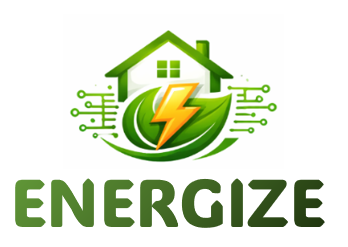

# ENERGIZE NILM

<p align="center">
  
</p>

<p align="center">
  <b>ENERGIZE Project</b> — DNN-based Non-Intrusive Load Monitoring
</p>

<p align="center">
  
  
  
</p>

---

## Overview

**ENERGIZE NILM** is the baseline deep learning code for appliance-level energy disaggregation developed within the **ENERGIZE** project. Given a single whole-home power signal from the **PLEGMA** dataset, the models learn to estimate the individual power consumption of target appliances — without any additional hardware sensors.

Three PyTorch architectures are provided:

| Model | Architecture | Strategy | Input Window |
|-------|-------------|----------|-------------|
| **CNN** | 1-D Convolutional Network | Seq2Point | 299 samples |
| **GRU** | Gated Recurrent Unit | Seq2Point | 199 samples |
| **TCN** | Temporal Convolutional Network | Seq2Seq | 600 samples |

---

## Dataset — PLEGMA

The **PLEGMA** dataset is a Greek residential smart meter dataset recorded at **10-second** intervals. It covers multiple households and includes sub-metered appliance readings used as ground truth for NILM training and evaluation.

**Supported appliances**

| Appliance | Threshold | Cutoff |
|-----------|-----------|--------|
| `boiler` | 50 W | 5000 W |
| `ac_1` | 50 W | 2300 W |
| `washing_machine` | 50 W | 2600 W |
| `fridge` | 50 W | 400 W |

**House splits** — models are evaluated on fully unseen houses:

| Split | Houses |
|-------|--------|
| Train | 1, 3, 4, 5, 6, 7, 8, 9, 11, 12, 13 |
| Validation | 10 |
| Test | 2 |

Download the PLEGMA dataset from the [official source](https://pureportal.strath.ac.uk/en/datasets/plegma-dataset) and place it under `data/PlegmaDataset_Clean/`.

---

## Project Structure

```
ENERGIZE-NILM/
├── main.py                          # Training & evaluation entry point
├── requirements.txt
│
├── src_pytorch/                     # Core PyTorch library
│   ├── config.py                    # All static hyperparameters
│   ├── models/                      # CNN, GRU, TCN model definitions
│   ├── data_loader/                 # PyTorch Dataset and DataLoader wrappers
│   ├── trainer.py                   # Training loop, callbacks, checkpointing
│   ├── tester.py                    # Evaluation and metrics
│   └── utils.py                     # Reproducibility helpers, device selection
│
├── data/
│   ├── data.py                      # Data pre-processing entry point
│   ├── processed/                   # Generated CSV files (after data prep)
│   └── dataset_management/
│       └── plegma/                  # PLEGMA parser
│
├── outputs/                         # Checkpoints, TensorBoard logs, metrics
│
├── notebooks/
│   └── 01_data_prep_training.ipynb  # Interactive training notebook (Colab-ready)
│
└── docs/
    └── energise_banner.png          # Project banner (place your image here)
```

---

## Installation

```bash
# Clone the repository
git clone https://github.com/your-org/energize-nilm.git
cd energize-nilm

# Create and activate a virtual environment (recommended)
python -m venv .venv
source .venv/bin/activate        # Linux / macOS
.venv\Scripts\activate           # Windows

# Install dependencies
pip install -r requirements.txt
```

---

## Quick Start

### Step 1 — Prepare the data

```bash
cd data
python data.py --dataset plegma --appliance boiler
```

This reads the raw PLEGMA data, applies normalisation, and writes three CSV files to `data/processed/plegma/boiler/`:

```
training_.csv     validation_.csv     test_.csv
```

Repeat for any other appliance:

```bash
python data.py --dataset plegma --appliance ac_1
python data.py --dataset plegma --appliance washing_machine
python data.py --dataset plegma --appliance fridge
```

### Step 2 — Train and evaluate

```bash
# Default experiment: boiler / TCN
python main.py

# Custom model
python main.py --dataset plegma --appliance boiler --model tcn

# Evaluate only (load an existing checkpoint)
python main.py --eval-only --checkpoint outputs/tcn_boiler/checkpoint/model.pt
```

Results are written to `outputs/<model>_<appliance>/metrics/`.

### Step 3 — Interactive notebook

Open `notebooks/01_data_prep_training.ipynb` for a guided walkthrough including data visualisation and live training curves. Compatible with **Google Colab** — follow the setup cell at the top.

---

## Configuration

All static hyperparameters are defined in [src_pytorch/config.py](src_pytorch/config.py).
Only three values need to be set per experiment:

```python
DATASET_NAME   = 'plegma'
APPLIANCE_NAME = 'boiler'   # boiler | ac_1 | washing_machine | fridge
MODEL_NAME     = 'tcn'      # cnn | gru | tcn
```

**Key training parameters**

| Parameter | Default | Description |
|-----------|---------|-------------|
| Epochs | 100 | Maximum training epochs |
| Learning rate | 0.001 | Adam initial learning rate |
| Early stopping patience | 6 | Epochs without improvement before stopping |
| TCN depth | 9 | Number of dilated conv blocks |
| TCN filters | [512, 256, …, 512] | Filters per block |

---

## Outputs

After training, the following artefacts are written under `outputs/<model>_<appliance>/`:

```
outputs/tcn_boiler/
├── checkpoint/
│   ├── model.pt        # Best model weights (.pt)
│   └── model.pth       # Best model weights (.pth)
├── tensorboard/        # TensorBoard event files
└── metrics/
    └── boiler_tcn_results.csv
```

Launch TensorBoard to inspect training curves:

```bash
tensorboard --logdir outputs/tcn_boiler/tensorboard
```

---

## Evaluation Metrics

| Metric | Description |
|--------|-------------|
| **MAE** | Mean Absolute Error in Watts — primary regression metric |
| **F1** | Harmonic mean of precision and recall for the ON/OFF state |
| **Precision** | Fraction of predicted ON states that are truly ON |
| **Recall** | Fraction of true ON states that were correctly detected |
| **Accuracy** | Overall ON/OFF classification accuracy |

---

## Normalisation

- **Aggregate signal** — z-score: `(x − mean) / std`
- **Appliance signal** — cutoff scaling: `y / cutoff`
- During evaluation, predictions are denormalised and clipped to `[0, cutoff]` before metric calculation

---

## Adding the Project Banner

Place your ENERGIZE project banner image at:

```
docs/energise_banner.png
```

Any `.png` or `.jpg` with a roughly 3:1 aspect ratio (e.g., 1200 × 400 px) works well.

---

## Citation

If you use this code in your research, please cite the ENERGIZE project:

```bibtex
@misc{energize-nilm,
  title  = {ENERGIZE NILM: DNN-based Non-Intrusive Load Monitoring},
  year   = {2024},
  url    = {https://github.com/your-org/energize-nilm}
}
```

---

## License

This project is released under the MIT License.
